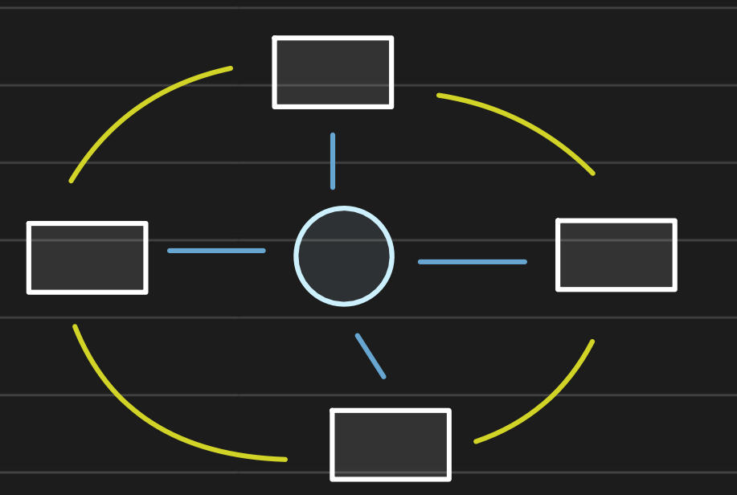
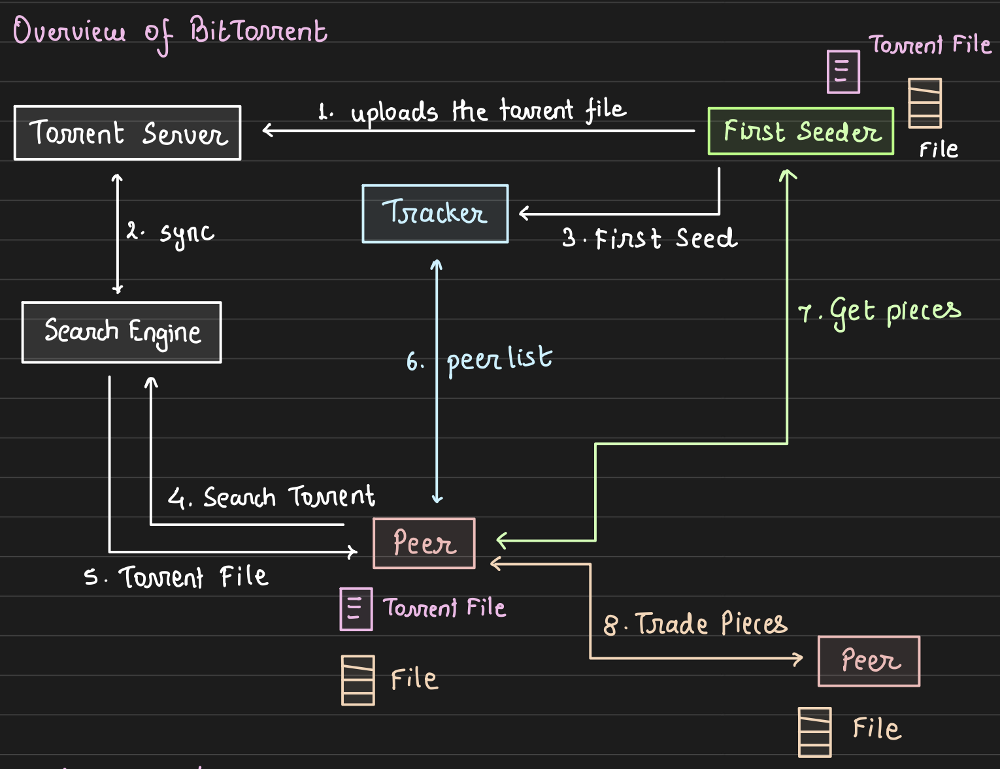

# Bittorrent-Client-Implementation

## Description

This project is a peer-to-peer file sharing network that enables users to share, download, and remove files from the group they belong to. Download happens parallelly with multiple pieces from multiple peers. It follows a similar concept to popular file sharing protocols like BitTorrent found on the internet.

The architecture of this Mini-Torr project consists of multiple clients (users) and a tracker. The tracker plays a crucial role in maintaining the network by storing metadata related to the files and users. Specifically, the tracker maintains a mapping of files to the users who possess them. This mapping helps clients discover other users who have the desired files they wish to download.



_Hybrid Peer-to-peer_

_Source: https://courses.arpitbhayani.me/bittorrent-internals/learn_

## Directory Structure

```
├── README.md
├── client
│   ├── Makefile
│   ├── client.cpp
│   ├── server.cpp
│   ├── tracker_info.txt
│   ├── utils.cpp
│   └── utils.h
└── tracker
    ├── Makefile
    ├── server.cpp
    ├── tracker.cpp
    ├── tracker_info.txt
    ├── utils.cpp
    └── utils.h

```

## Functional Requirements

The network for the Mini-torrent project will consist of the following entities:

1. Tracker(Centralized Server):

   - Maintain information of clients with their files (shared by client) to assist the clients for communication between peers.
   - Tracker should be online all the time.

2. Clients:
   - Users should create an account and register with the tracker.
   - Login using the user credentials.
   - Create a group and become the owner of that group.
   - Fetch a list of all groups in the server.
   - Request to join a group.
   - Leave a group.
   - Accept group join requests (if the client is the owner).
   - Share a file across the group: Share the filename and SHA1 hash of the complete file, as well as piecewise SHA1, with the tracker.
   - Fetch a list of all shareable files in a group.
   - Download a file:
     - Retrieve peer information from the tracker for the file.
     - **Core Part**: Download the file from multiple peers simultaneously, obtaining different pieces of the file from different peers (using a piece selection algorithm).
     - All downloaded files by the client will be shareable to other users in the same group.
     - Ensure file integrity through **SHA1** comparison.
   - Show ongoing downloads.
   - Stop sharing a file.
   - Stop sharing all files (Logout).
   - Whenever a client logs in, all previously shared files before logout should automatically be in sharing mode.

### Execution

1. Inside client directory open terminal and run "make" command.
2. Now run ./client <IP>:<PORT> tracker_info.txt to run a peer.
3. Inside tracker directory open terminal and run "make" command.
4. To run both trackers run the below commands on two different terminals
   4.1 ./tracker tracker_info.txt 1
   4.2 ./tracker tracker_info.txt 2
5. Use make clean to clear the .o files and the executable file.
6. tracker_info.txt file have the IP and Port details of all the trackers.

## Client Commands

Commands:

1. Create User Account:
   `create_user <user_id> <password>`

2. Login:
   `login <user_id> <password>`

3. Create Group:
   `create_group <group_id>`

4. Join Group:
   `join_group <group_id>`

5. Leave Group:
   `leave_group <group_id>`

6. List Pending Join:
   `list_requests <group_id>`

7. Accept Group Joining Request:
   `accept_request <group_id> <user_id>`

8. List All Groups in Network:
   `list_groups`

9. List All Sharable Files in Group:
   `list_files <group_id>`

10. Upload File:
    `upload_file <file_path> <group_id>`

11. Download File:
    `download_file <group_id> <file_name> <destination_path>`

12. Logout:
    `logout`

13. Show Downloads:
    `show_downloads`

- Output format: `[D] [grp_id] filename` or `[C] [grp_id] filename` (D - Downloading, C - Complete)

14. Stop Sharing:
    `stop_share <group_id> <file_name>`

## Architecture


_Source: https://courses.arpitbhayani.me/bittorrent-internals/learn_

## Implementation

<!-- ### Socket Programming

Socket programming is employed in this Mini-Torr project to establish communication channels between the tracker and clients. Both the tracker and client continuously listen for incoming requests, enabling seamless data exchange and coordination within the peer-to-peer network.

### Multithreading

To facilitate parallel downloads and enhance performance, multithreading is utilized in the project. Each download request is assigned to a separate thread, allowing multiple file pieces to be downloaded simultaneously from different peers. This approach significantly improves the download speed and efficiency of the Mini-torrent system.

### SHA1

The SHA1 algorithm is employed to maintain data integrity within the Mini-torrent network. Chunkwise hashing using SHA1 ensures that downloaded file pieces match their corresponding checksums. By comparing the computed SHA1 hash with the expected value, the system verifies that the downloaded data has not been tampered with or corrupted during the transfer process. This integrity check mechanism helps guarantee the reliability and authenticity of shared files in the Mini-torrent network.

### Piece Selection Algorithm

- Ask Tracker to give file-peer information(i.e which peers has pieces of that file)
- Once we have the peers/clients info we connect with each peer and ask which Chunks does the peer have. Peer responds with chunk numbers it possess.
- Now, we have chunk to peer mapping(i.e for some chunk, which all peers possess it), We will take random peer and ask for that chunk.
- After downloading a chunk, if the SHA/hash matches, it is taken.
- At the end it will be checked if all the Chunks are present or not. If not, we will do the above steps again one more time, if any chunk is not having a peer that means it cannot be downloaded completely. -->

### Peer Set

Each peer has a list of other peers it can connect with to download pieces of a file. However, it can only send data to a specific group of those peers, which we call the "Active Peer Set."

### Pieces

The original file is divided into equal-sized parts, and a unique code (called SHA-1) is created for each part. These codes are listed in a special file called a ".torrent" file. Peers use these codes to download the corresponding parts of the file. Once they have all the parts, they put them together to make the complete file.

### Tracker

The tracker is like a central hub for a torrent network. It keeps track of all the peers involved in sharing the file. It's basically a simple web server that answers questions from peers and stores information about their status.

Every torrent file has a special web address (URL) for the tracker. Peers use this address to find and talk to the tracker. The tracker keeps track of:

- Who has parts of the file.
- Who is currently downloading the file.
- Who needs help finding other peers.

However, the tracker doesn't actually download or participate in getting the real content of the file. It only manages the information about the file.

### Leecher

A leecher is just a peer in the network that is downloading parts of the file and waiting for the download to finish. Leechers talk to the tracker to get a list of 50 other peers to connect with and get the parts they need. They also help other leechers by sharing the parts they've already downloaded. This helps spread the file across the network faster.

### Seeder

A seeder is a peer who has all the parts of the file and doesn't need to download anything. If a leecher can't find a part they need from another leecher, they can get it from a seeder. Once a leecher finishes downloading the whole file, they become a seeder and continue sharing the file with others.

### Choke Algorithm

In a peer-to-peer network, everyone wants to download as fast as possible. But if everyone tries to download at once, it can overload some peers. BitTorrent uses an algorithm called "Choke" to make sure:

- Peers who share and play nice get the fastest downloads.
- People who try to cheat the system are slowed down.

### Piece Selection Algorithm

Choosing how to download parts of the file is important. If everyone starts with the same part, it can slow things down. Also, what if the seeder leaves before everyone finishes downloading?

> In this project, we use a strategy called the "Rarest Piece First Algorithm." This means peers try to get the parts that are the hardest to find first. It helps distribute the file more efficiently.

## Resources

1. https://www.researchgate.net/publication/29621932_Understanding_BitTorrent_An_Experimental_Perspective

2. https://courses.arpitbhayani.me/bittorrent-internals/learn
